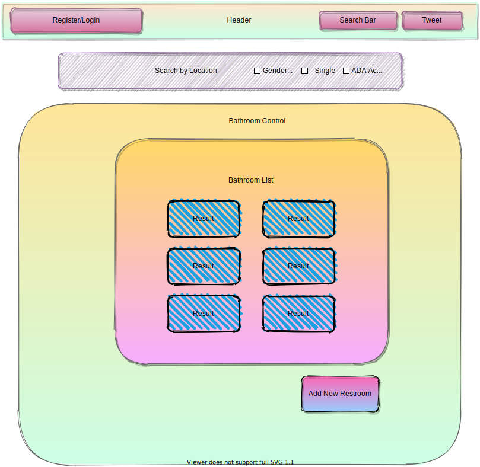

<h1 align="center">
   
  
   
A Place To Go   
</h1>

<h4 align="center">Crowd-sourced safe restroom database for when you need to go </h4>

<a href="#description">Description</a> •
  <a href="#key-features">Key Features</a> •
  <a href="#how-to-use">How To Use</a> •
  <a href="#reach-out"> Reach Out </a> •
  <a href="#credits">Credits</a> •
  <a href="#you-may-also-like">Related</a> •
  <a href="#license">License</a>

## Proposal

Finding a safe restroom while out-and-about can be challenging for certain communities, such as people who don’t feel comfortable using gendered restrooms, or need extra space/accommodations. Trans/Gender Expansive/Intersex folks who use the restroom that best reflects their gender identity are often subject to ridicule and violence, or they just won’t go. Everyone has the right to safely use the restroom of their choice. This app is for anyone who has questioned whether their safety is on the line when they just need a place to go.

## Key Features

- Search by name of restroom
- Easy to use Navigation Bar
- Register/Login to account
- See all restrooms you've added to your safe list
- Add a bathroom
- Edit entries
- Add comments to bathrooms
- Delete a bathroom
- Request a buddy (coming soon!)

- Cross platform
  - Windows, macOS and Linux ready.

## Wireframing

## How To Use

(3 methods)

1. [Visit the site](https://a-place-to-go-d3310.firebaseapp.com/)

2. To clone and run this application, you'll need [Git](https://git-scm.com), [Node.js](https://nodejs.org/en/download/) and [NPM](https://www.npmjs.com/get-npm) installed.

3. If you wish to review the raw code, it's easiest to download a code editor such as Visual Studio Code or Atom and follow these steps:

   ### Clone this repository from your Command Line:

   `$ git clone https://github.com/MarielHamson/APlaceToGo.git`

   From your command line:

   ### Go into the repository

   `$ cd APlaceToGo`

   ### Open repository in VS Code or other

   `$ code .`

   ### Install dependencies in Root Project Directory (a-place-to-go)

   `$ npm install`

   ### Run the app

   `$ npm start`

## Reach Out

A Place To Go is [emailware](https://en.wiktionary.org/wiki/emailware). Meaning, if you liked using this app or it has helped you in any way, I'd like you send me an email at <mariel.hamson@gmail.com> about anything you'd want to say about this software. I'd really appreciate it!

## Technology Used

|                                                                                                          |                                                                                          |                                                                                              |                                                                                          |
| -------------------------------------------------------------------------------------------------------- | ---------------------------------------------------------------------------------------- | -------------------------------------------------------------------------------------------- | ---------------------------------------------------------------------------------------- |
|                     |  |                            |  |  |
|  |                   |  |

## Support

Or

## You may also like...

[Project Me Finder](www.github.com/MarielHamson/ProjectMeFinder)  
[Safer Spaces](www.github.com/MarielHamson/SaferSpaces.Client)

## License

MIT

---

> LinkedIn [MarielHamson](https://www.linkedin.com/MarielHamson) &nbsp;&middot;&nbsp;
> GitHub [MarielHamson](https://github.com/MarielHamson) &nbsp;&middot;&nbsp;
> Instagram [Miriquitecontrary](https://instagram.com/miriquitecontrary)
